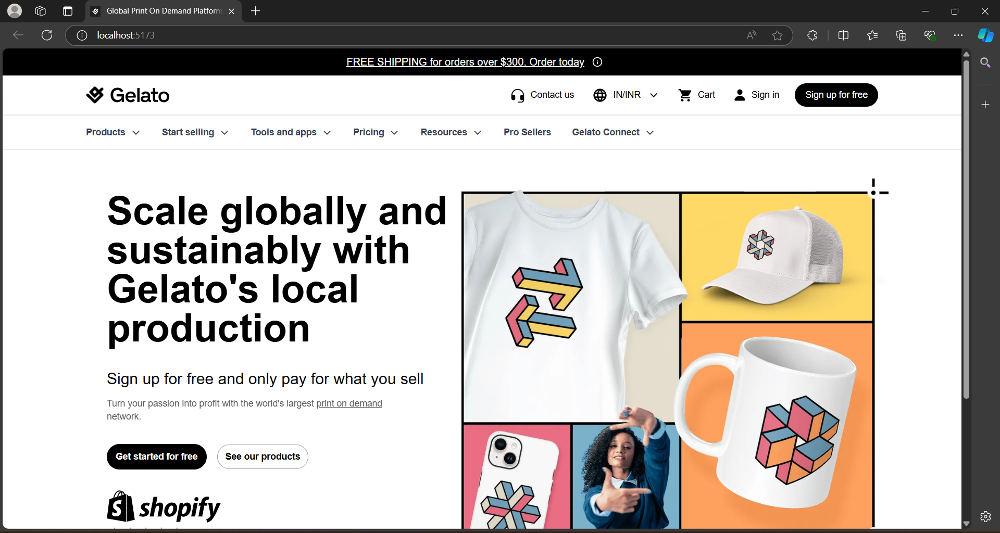

# Gelato-Inspired Homepage

A responsive homepage inspired by the Gelato website, built with React, Vite, and Tailwind CSS. This project showcases a modern, clean design with a focus on responsiveness and user experience.

**Live Demo -** [Inspired Homepage](https://anandyelloju.github.io/gelato-homepage-inspired/)

## Table of Contents

- [Screenshots](#screenshots)
- [Installation](#installation)
- [Usage](#usage)
- [Features](#features)
- [Technologies Used](#technologies-used)
- [Deployment](#deployment)
- [Acknowledgements](#acknowledgements)
- [License](#license)

## Screenshots



## Installation

To get started with the project, follow these steps:

1. Clone the repository:
    ```bash
    git clone https://github.com/yourusername/gelato-homepage-inspired.git
    ```
2. Navigate to the project directory:
    ```bash
    cd gelato-homepage-inspired
    ```
3. Install dependencies:
    ```bash
    npm install
    ```
4. Start the development server:
    ```bash
    npm run dev
    ```

## Usage

Open your browser and go to http://localhost:5173/ to see the homepage in action.

## Features

- Responsive layout
- Clean design inspired by the Gelato homepage
- Implemented navigation bar and key components
- Built with React, Vite, and Tailwind CSS

## Technologies Used

- **React**: A JavaScript library for building user interfaces.
- **Vite**: A fast build tool for modern web projects.
- **Tailwind CSS**: A utility-first CSS framework for creating custom designs.

[](https://skillicons.dev)

## Deployment

To deploy the project, you can use GitHub Pages, Netlify, or Vercel. For GitHub Pages, follow these steps:

1. Build the project:
    ```bash
    npm run build
    ```
2. Deploy the build folder:

    - Create a gh-pages branch:
    ```bash
    git checkout -b gh-pages
    ```
    - Add and commit the build folder:
    ```bash
    git add -f dist
    git commit -m "Deploy to GitHub Pages"
    ```
    - Push to GitHub:
    ```bash
    git push origin gh-pages
    ```
3. Go to your GitHub repository settings and enable GitHub Pages from the gh-pages branch.

## Acknowledgements

- Inspired by the Gelato homepage design
- Tailwind CSS documentation
- React and Vite documentation

## License

This project is licensed under the [MIT License](https://choosealicense.com/licenses/mit/) - see the [LICENSE](https://github.com/anandyelloju/weather-app/blob/main/LICENSE) file for details.